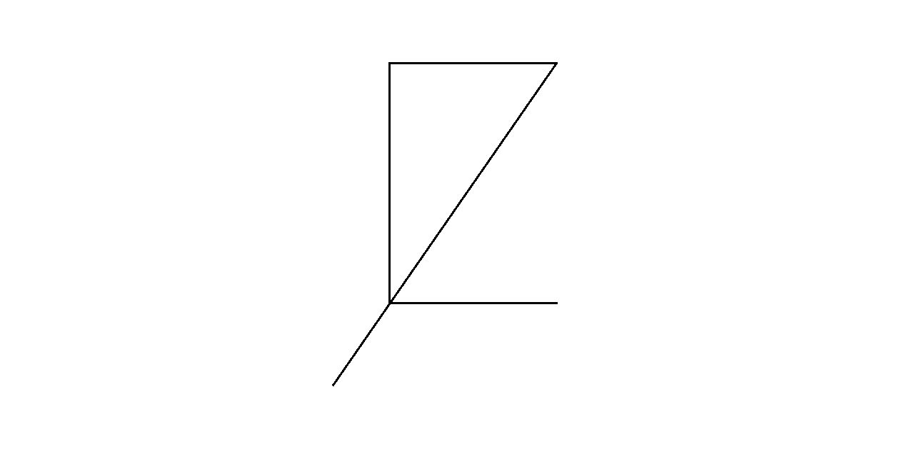

# LayZ Renderer Engine



**LayZ** is a simple cross-platform renderer engine written in C/C++ using OpenGL specification. 


## Fire up the engine, make that LayZ work!

Check [wiki](https://github.com/AliKhudiyev/LayZ-Renderer-Engine/wiki)(not completely prepared yet).

### Linux installation
Type in the terminal:

```
sudo apt-get install libglfw3-dev
sudo apt-get install libglew-dev
```

### MacOS installation
You should install [brew](https://brew.sh/) first and then type in the terminal:

```
brew install glfw3
brew install glew
```

## Windows installation
Don't do anything and it'll be all fine some day... (Because project contains precompiled binaries and include files for windows already :))

<table>
<thead>
<tr>
    <th colspan=2 style="text-align:center">Requirements</th>
</tr>
</thead>

<tbody>
<tr>
    <td>OS</td>
    <td>Linux, MacOS, Windows</td>
</tr>
<tr>
    <td>OpenGL version</td>
    <td>3.3+</td>
</tr>
<tr>
    <td>RAM</td>
    <td>2 GB</td>
</tr>
<tr>
    <td>Disk space</td>
    <td>3 GB</td>
</tr>
</tbody>
</table>


## How to use

There is a [wiki](https://github.com/AliKhudiyev/LayZ-Renderer-Engine/wiki)(not completely prepared yet) that you can always open and check the detailed tutorials.

```
#include <layz.h>

using namespace std;

int main() {

    lyz::graphics::Window win = lyz::graphics::Window("Example Window", 640, 480);
    auto renderer = lyz::graphics::Renderer::getRenderer();
    
    auto rectangle = new lyz::graphics::Rectangle(0.0, 0.0, 320.0, 240.0);
    rectangle->setColor(LYZ_COLOR3(0.0, 1.0, 1.0));

    while(win->isRunnning()) {
        renderer->clear();

        renderer->store(rectangle);
        renderer->draw();
        
        win->onUpdate();
    }
    
    return 0;
}

```